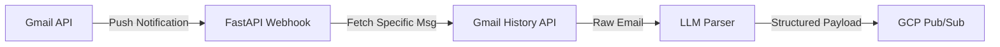

# CareerScope Email Intelligence System

A serverless event watcher for the **Career Operating System**. 

This system acts as an autonomous agent that monitors a candidate's inbox. Instead of relying on inefficient polling, it leverages **Gmail Push Notifications** to instantly trigger a **GCP Pub/Sub** webhook when a new recruitment email arrives. It then uses Gemini to extract structured intelligence from unstructured recruiter emails and broadcasts the events back to the CareerScope ecosystem.

## Architecture



1. **Webhook Listener (`main.py`)**: A FastAPI server that exposes `/webhook/gmail` (for inbound push notifications) and `/webhook/agent/followup` (for triggering agents).
2. **Efficient Fetcher (`gmail_client.py`)**: Uses the `historyId` to query the Gmail API for *only* the specific email that triggered the push. Also contains `create_draft` to act on the inbox.
3. **LLM Extraction (`parser.py`)**: Passes the raw email body to Gemini (via the `shared` SDK) using strict prompt engineering to classify the email.
4. **Event Publisher (`publisher.py`)**: Serializes the extracted intelligence into a Pydantic event payload and publishes it to the `careerscope.events` Pub/Sub topic.
5. **Domain Agents (`agents/followup_agent.py`)**: Contains agentic workflows. For example, the Follow-Up Agent is triggered after 7 days of silence. It uses Gemini to draft a tailored follow-up email and uses the Gmail API to drop it straight into the user's Drafts folder.

## Prerequisites

- **Python 3.12+**
- **Google Cloud Console Project**: 
  - Gmail API enabled.
  - OAuth 2.0 Client ID (`credentials.json` downloaded).
  - Cloud Pub/Sub API enabled.
- **CareerScope Shared SDK**: Must be installed locally (`pip install -e ../shared`).

## Local Setup

1. **Install Dependencies**:
   ```bash
   pip install -r requirements.txt
   pip install -e ../shared  # Install the CareerScope Shared SDK
   ```

2. **OAuth Credentials**:
   - Create OAuth 2.0 credentials (Desktop app) in Google Cloud Console.
   - Download the file and save it as `credentials.json` in the root of this repository.

3. **Environment Variables**:
   - Create a `.env` file containing your Gemini API Key and GCP Project ID.
   ```bash
   GEMINI_API_KEY=your_api_key
   GOOGLE_CLOUD_PROJECT=your_project_id
   ```

## Running the Webhook Locally

Since Gmail Push requires a public HTTPS endpoint, you can use **ngrok** to test locally.

1. **Start the FastAPI Server**:
   ```bash
   uvicorn main:app --reload --port 8000
   ```

2. **Expose the port with ngrok**:
   ```bash
   ngrok http 8000
   ```

3. **Configure Gmail Push**:
   In GCP, set the Pub/Sub Push Endpoint to your ngrok URL: `https://<your-ngrok-id>.ngrok-free.app/webhook/gmail`.

## Deployment

This service is designed to be completely serverless. It should be deployed to **Google Cloud Run**. Because it relies on push notifications, the container will scale down to zero when no emails are arriving, costing exactly $0.00 until a recruiter emails you.
